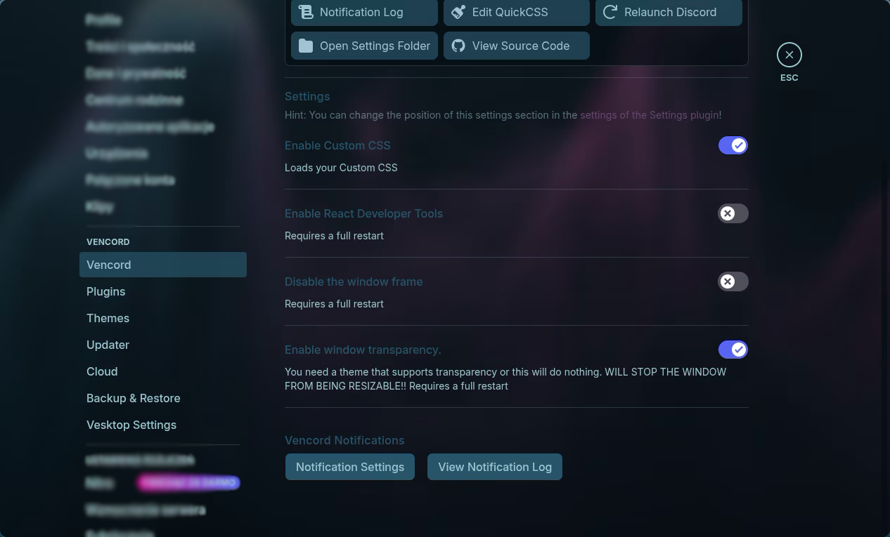

# Showdown
I've had a rather uncomfortable monitor placement at my job. The light would
often come from behind a monitor and dark mode became tiring really fast for my
eyes.
That's when I knew what I needed from my dotfiles:
- Altering themes between dark and light mode
- Pywal, to make it pretty
- Transparency on everything that can have transparency!

## Waybar
Dark theme:


Light theme:


Transparent apps


Rofi-based power-menu


Hyprlock:


# Introduction
Custom Linux rice and configuration files, optimized for speed, minimalism, and style.  
Originally inspired by [ml4w's dotfiles](https://github.com/ml4w), but heavily modified - you'd never guess the origin now.

---

## ✨ Highlights

- ✅ Waybar based on **Mechabar**, heavily modified
- 🎨 Dynamic pywal-based theming
- ⚡ Wallpaper switcher rewritten in **Go** — up to **17× faster**
- 🧼 Cleanup of unused variables, consistent formatting
- 🔀 Custom theme switcher
- 🧪 Benchmarks comparing Shell vs Go

---

## Quickstart
```sh
git clone https://github.com/nxtkofi/nxtdots ~/.config/
chmod +x .config/scripts/bin/main
.config/scripts/bin/main install
```

This installation script SHOULD work on a freshly installed arch system. It
should download yay and the necessary packages for You.
Howver, due to lack of time, **it was not yet tested**, therefore the script may not work properly.

---

## Requirements

Packages:
- fzf
- waybar 0.13.0 (0.14.0 has an issue rendering some things)
- vesktop 
- walcord
- spicetify-cli
- python-pywal16
- magick
- nmtui
- bluetuith
- pacseek
- power-profiles-daemon

--- 

## 🧠 Background

This config started as a fork of ml4w’s dotfiles — I borrowed a lot of basics to get started.  
Since then, the setup evolved significantly:

- Removed redundant scripts and variables
- Created a **pywal-integrated theming system** for Waybar
- Customized Waybar’s style and logic
- Added **dynamic theme switching** with a script

> Today, it’s a completely independent and streamlined setup tailored for performance and aesthetic.

---

## 🚀 Why I Migrated Scripts to Go (and how I sped them up by ~94.2%)

At some point I decided to rewrite core scripts in **Go**, primarily out of curiosity and for the challenge.  
But the performance gains were a huge bonus.

### 💥 Final Results

The main script (wallpaper changer):

| Method     | Speed Gain |
|------------|------------|
| `go run`   | ~15.5×     |
| Binary     | ~17×       |

And it's still clean, readable, and scalable for future additions.


---

## 🖼️ Preview


---

## Configuration

### Edited .desktop files

For floating pacseek (windowrule is already configured in
~/.config/hypr/conf/windowrule.conf) You have to edit org.moson.pacseek.desktop
file that's located in /usr/share/applications directory like so:
- pacseek
```.config
[Desktop Entry]

Name=pacseek
Comment=A terminal user interface for searching and installing Arch Linux packages

Icon=pacseek
Type=Application
Categories=Utility;
Keywords=terminal;package;

Exec=kitty --class Pacseek pacseek
StartupNotify=false
Terminal=false
```

- vesktop
```
[Desktop Entry]
Name=Vesktop
Exec=/usr/bin/vesktop %U
Terminal=false
Type=Application
Icon=/home/<your-profile>/.config/assets/discord_custom.png
StartupWMClass=vesktop
GenericName=Internet Messenger
Categories=Network;
Keywords=discord;vencord;electron;chat;
Comment=Vesktop is a custom Discord App aiming to give you better performance and improve linux support. Vencord comes pre-installed
MimeType=x-scheme-handler/discord
```

>[!NOTE]
> If you want Your vesktop to be transparent You have to turn on transparency
> in vencord options. Open Vesktop -> Settings -> Vencord -> `Enable window transparency.`


- spotify
```
[Desktop Entry]
Type=Application
Name=Spotify
GenericName=Music Player
Icon=spotify-client
TryExec=spotify
Exec=/home/<your-profile>/.config/settings/launch-spotify.sh
Terminal=false
MimeType=x-scheme-handler/spotify;
Categories=Audio;Music;Player;AudioVideo;
StartupWMClass=spotify          
```

### Commands:
Spotify rice:
- sudo chmod a+wr /opt/spotify
- sudo chmod a+wr /opt/spotify/Apps -R
One time:
`sudo systemctl enable --now power-profiles-daemon`
`spicetify config current_theme Sleek`
`spicetify apply`

---
## Thanks
Thanks to ml4w for providing such a great base for this ricing
Big thanks to - https://www.reddit.com/r/unixporn/comments/1chv3tr/hyprland_everything_pywal/ (repo:https://github.com/magnusKue/wal-switcher/tree/master), he made pywal spicetifying easy!

