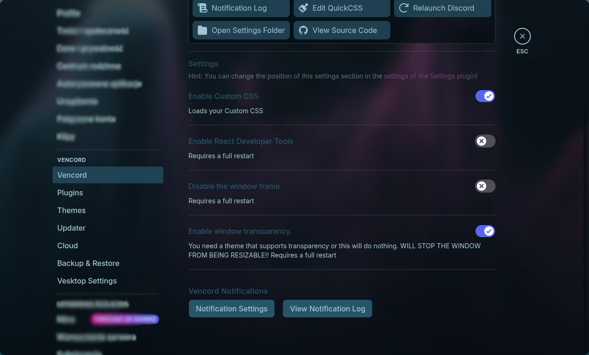

# Showdown
I've had a rather uncomfortable monitor placement at my job. The light would
often come from behind a monitor and dark mode became tiring really fast for my
eyes.
That's when I knew what I needed from my dotfiles:
- Altering themes between dark and light mode
- Pywal, to make it pretty
- Transparency on everything that can have transparency!

## Waybar
Dark theme:


Light theme:


Transparent apps


Rofi-based power-menu


Hyprlock:


# Introduction
Custom Linux rice and configuration files, optimized for speed, minimalism, and style.  
Originally inspired by [ml4w's dotfiles](https://github.com/ml4w), but heavily modified - you'd never guess the origin now.

---

## ✨ Highlights

- ✅ Waybar based on **Mechabar**, heavily modified
- 🎨 Dynamic pywal-based theming
- ⚡ Wallpaper switcher rewritten in **Go** — up to **17× faster**
- 🧼 Cleanup of unused variables, consistent formatting
- 🔀 Custom theme switcher
- 🧪 Benchmarks comparing Shell vs Go

---

## Quickstart

### Fresh Arch Linux Installation

⚠️ **IMPORTANT**: This script is designed for **fresh Arch Linux installations only**. Running on systems with existing dotfiles may cause conflicts.

```sh
# Clone the repository
git clone https://github.com/nxtkofi/nxtdots ~/.config/

# Build the binary from source
cd ~/.config/scripts && go build -o bin/main main.go

# Run the installation (requires sudo access)
~/.config/scripts/bin/main install
```

### Requirements for Installation:
- Fresh Arch Linux system
- Internet connection
- Sudo privileges
- **DO NOT run as root user** (script will install yay which requires non-root)

### What the script does:
- Installs `yay` AUR helper if not present
- Installs all required packages
- Configures wallpapers, themes, and system services
- Sets up SDDM login manager
- Configures Waybar themes

⚠️ **Warning**: Do not run the installation script multiple times on the same system as it may cause configuration conflicts.

---

## Customizing your setup

This repo is the shared core. Keep personal changes in `*.local.*` files so you can still pull upstream updates.

- Shared config change: edit `~/.config/...`, then run `chezmoi add ~/.config/path/to/file` and commit it in `~/.local/share/chezmoi`.
- New shared config folder: create it under `~/.config/...`, test it, then `chezmoi add ~/.config/path/to/folder`.
- Public local hook: add an empty placeholder in the source repo with `create_empty_`, e.g. `home/dot_config/hypr/conf/create_empty_monitor.local.conf` creates `~/.config/hypr/conf/monitor.local.conf` only if it is missing.
- Private override: put the real `*.local.*` content in `~/.local/share/chezmoi-private/dot_config/...` and apply it with `chezmoi apply -S ~/.local/share/chezmoi-private`.

Recommended apply order:

```sh
chezmoi apply
chezmoi apply -S ~/.local/share/chezmoi-private
```

Public `create_empty_*` files prevent missing-file errors for new users. Private `.local` files override them on your own machine without forking the core config.

---

## Requirements

Those packages will be automatically installed if You run install script:
- kitty 
- fzf 
- waybar 
- downgrade 
- vesktop 
- walcord 
- spicetifyli
- python-pywal16 
- imagemagick 
- bluetui 
- power-profiles-daemon 
- zen-browser-bin 
- hyprland 
- spotify 
- pacseek 
- waypaper 
- rofi 
- hyprlock 
- hyprpaper 
- nautilus 
- fastfetch 
- starship 
- zoxide 
- noto-fonts-emoji
- ttf-jetbrains-mono-nerd 
- ttf-firacode-nerd 
- nerd-fonts-fira-code 
- swaync 
- xdg-desktop-portal 
- xdg-desktop-portal-gtk 
- xdg-desktop-portal-hyprland 
- sddm 
- qt6-svg 
- qt6-virtualkeyboard 
- qt6-multimedia-ffmpeg 
- nvm
- hypridle 

Optional (still included in installation script):
- rofimoji
- ripgrep 
- missioncenter 
- nvim
--- 

## 🧠 Background

This config started as a fork of ml4w’s dotfiles — I borrowed a lot of basics to get started.  
Since then, the setup evolved significantly:

- Removed redundant scripts and variables
- Created a **pywal-integrated theming system** for Waybar
- Customized Waybar’s style and logic
- Added **dynamic theme switching** with a script

> Today, it’s a completely independent and streamlined setup tailored for performance and aesthetic.

---

## 🚀 Why I Migrated Scripts to Go (and how I sped them up by ~94.2%)

At some point I decided to rewrite core scripts in **Go**, primarily out of curiosity and for the challenge.  
But the performance gains were a huge bonus.

### 💥 Final Results

The main script (wallpaper changer):

| Method     | Speed Gain |
|------------|------------|
| `go run`   | ~15.5×     |
| Binary     | ~17×       |

And it's still clean, readable, and scalable for future additions.


---

>[!NOTE]
> If you want Your vesktop to be transparent You have to turn on transparency
> in vencord options. Open Vesktop -> Settings -> Vencord -> `Enable window transparency.`


### Commands:

#### Spotify Rice Setup:

⚠️ **PREREQUISITES**: Before running the Spotify rice script:
1. **Launch Spotify** and **log in** to your account
2. **Close Spotify** completely
3. Only then run the rice script

```sh
# After Spotify is installed and you've logged in at least once:
~/.config/scripts/bin/main rice-spotify
```

Manual commands (if needed):
- `sudo chmod a+wr /opt/spotify`
- `sudo chmod a+wr /opt/spotify/Apps -R`

One time setup:
- `sudo systemctl enable --now power-profiles-daemon`
- `spicetify config current_theme Sleek`
- `spicetify apply`

---
## Thanks
Thanks to ml4w for providing such a great base for this ricing
Big thanks to - https://www.reddit.com/r/unixporn/comments/1chv3tr/hyprland_everything_pywal/ (repo:https://github.com/magnusKue/wal-switcher/tree/master), he made pywal spicetifying easy!
